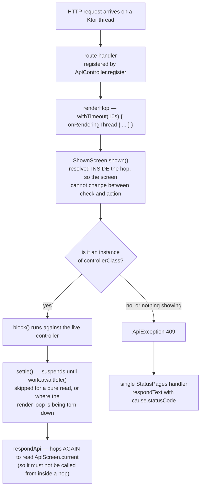

# Development API Harness

> **Incomplete and permanently WIP.** These notes record what has been investigated, not what exists. Anything not mentioned here is almost certainly "not looked at yet" rather than "not there" or "not a problem". Every main source file in the `api` module, its one test, and `api/build.gradle.kts` were read in full. Not covered: Ktor's own behavior beyond these call sites (when it applies a server module, what CIO does on shutdown), and the `core` types cited only where they appear here — `InputCode`, `DialogView`, `DialogManager`, `KgdfGame`, `UiScreen` — which were not opened. Nothing here says how a consumer should name its screens, shape its DTOs, decide what a response may expose, or keep this module out of a shipped artifact; all of that is the consumer's.

The `api` module is a development-only HTTP harness: an agent or script drives and observes a running game over loopback. It is a leaf — `core` does not depend on it, and nothing inside kgdfw calls any of its entry points, so every one of them is invoked by a consumer.

Read this before adding an endpoint, an `ApiController`, or anything that touches a ViewModel from a request. **The single rule that matters is the render-thread hop**, and getting it wrong does not throw: it kills the process, from a request that had been working.

## The rule: everything crosses onto the rendering thread

- [invariant] Every read and every drive goes through one primitive, `renderHop` — `withTimeout(RENDER_TIMEOUT) { onRenderingThread { block() } }` (`ShownScreen.kt:26`). Endpoints reach it through `ApiController.onRender` or `ScreenApiController.onScreen` rather than calling it directly.
- [trap] **The failure mode is process death, not an exception.** Setting a ViewModel binding rebuilds its Scene2D layout synchronously, and a rebuild can allocate a texture. That is an OpenGL call, and it aborts the JVM outright when it lands on a request thread instead of the one holding the GL context — nothing catches it and nothing points back at the endpoint (`ApiController.kt:21-23`) #silent-failure.
- [trap] It fails *late*. An endpoint that skips the hop is correct for every request whose binding rebuild happens not to allocate, so it passes review, passes manual use, and dies later against different state (`ScreenApiController.kt:40-42`).
- [invariant] **Nesting a hop is prevented by the types, not by discipline.** `renderHop` is `suspend` (`ShownScreen.kt:26`) while `onScreen` takes `block: C.() -> R` (`ScreenApiController.kt:33`) and `onRender` takes `block: () -> R` (`ApiController.kt:25`) — both non-suspend, so a hop inside a hop does not compile. It would otherwise deadlock until `RENDER_TIMEOUT`, the inner call waiting on a frame the outer block still holds. **Give either wrapper a suspend block and that deadlock becomes reachable**, which is the reason the signatures are worth preserving deliberately rather than tidying. The same applies to `respondApi`, which hops internally to read `ApiScreen.current` (`ApiResult.kt:23-24`).
- [fact] `RENDER_TIMEOUT` is 10 seconds, deliberately generous — a timeout here means the render loop stopped, which is worth surfacing rather than waiting out (`ShownScreen.kt:16-17`).
- [history] `respondApi` gained its hop in `12933ca` (2026-08-30); before it, that function read `ApiScreen.current` — which walks Scene2D — straight from the request thread, on **every** response. That was the last place the harness touched Scene2D without a hop, so as of that commit the rule holds with no exception left in the module.
- [invariant] `ApiController.settle()` is `withTimeout(60.seconds) { work.awaitIdle() }` and **suspends rather than blocks**: the work it waits on only advances from the render loop, so blocking would occupy the very thread that has to finish it (`ApiController.kt:40-44`) #order-dependent. `work` is an abstract `WorkSource` the consumer supplies; what `awaitIdle` guarantees, and why counting on submit is what makes a single read a fixpoint, is in [[Events, Async and State]].

## Server and registration

- [fact] `HarnessServer.serve(port, runGame)` starts a CIO `embeddedServer` bound to `127.0.0.1` with `wait = false`, calls `runGame()`, and stops the server in a `finally` with a 1s grace and 2s timeout (`HarnessServer.kt:32-58`).
- [decision] `serve` wraps the game rather than the game starting the server, because the game loop blocks. That bounds the server's lifetime by the game's without either one knowing the other (`HarnessServer.kt:28-29`).
- [invariant] The consequence for every endpoint: **the server is up before the game's objects exist and outlives them, so a handler must resolve what it acts on per request.** Capturing a controller, screen or ViewModel when the route is declared captures something not yet built, or something that will be replaced. This is why `ScreenApiController` resolves through `ShownScreen` inside the request rather than holding an instance #order-dependent.
- [fact] `ApiControllerRegistry.addRoutesToRouting` is a bare `forEach` over the controller list (`ApiControllerRegistry.kt:16`), reached once via `routing(ApiControllerRegistry::addRoutesToRouting)` (`HarnessServer.kt:34`). Routes are a snapshot of the list at that moment, not a live view of it.
- [risk] So every `ApiController` must be registered *before* `serve` is called; one registered later contributes no routes and reports nothing. Reading the source establishes the snapshot but not the exact instant Ktor applies the module block, which is what would pin how much slack there is — an experiment registering a controller from inside `runGame` would settle it #silent-failure.
- [decision] `register` is idempotent **by identity** (`controllers.none { it === controller }`), because the list is process-global with no teardown: a test JVM registering per spec would otherwise bind the same routes several times (`ApiControllerRegistry.kt:8-14`). `ApiScreen.registerScreens` repeats the pattern for the same reason (`ApiScreen.kt:38-44`).
- [trap] Registration is an explicit call by the consumer, and deliberately not self-registration from an `init` block the way `GameService` does it (see [[Events, Async and State]]). A Kotlin `object` initializes only when something touches it, so an `object` controller that self-registered would never run its own `init`, and would contribute no routes while looking correctly wired #silent-failure.
- [fact] `ContentNegotiation` sets `encodeDefaults = true`; without it a nullable field disappears from the wire exactly when it is null (`HarnessServer.kt:43-48`).

## Errors: one exception type, one handler

- [fact] The entire error channel is `ApiException(message, statusCode = InternalServerError)` (`ApiException.kt:5`) plus a single `StatusPages` handler that answers `respondText(cause.message ?: "An unknown error occurred", status = cause.statusCode)` (`HarnessServer.kt:39-41`). Handlers throw instead of returning an error shape, so no controller does its own error handling.
- [trap] **The status must be passed at the throw site.** The constructor defaults to 500, so an `ApiException` describing a caller mistake answers 500 unless the call gives `statusCode` explicitly.
- [trap] The handler is installed for `ApiException` only. Anything else escaping a handler falls through to Ktor's default — a 500 with no body this module wrote.
- [fact] Error responses go out as `respondText`, so an error body is plain text while every success body is an `ApiResult` JSON envelope. A client cannot parse both the same way.
- [fact] `ApiException` calls `Exception()` with no arguments and overrides `message`, so it never carries a `cause`.

## Response envelope and the reified-type constraint

- [decision] `ApiResult<T>(currentScreen, data)` puts `currentScreen` on **every** response rather than behind an endpoint of its own, because an action can change which screen is up and the caller cannot predict which one it lands on (`ApiResult.kt:9-17`).
- [invariant] `respondApi` must stay `inline` with a `reified T`. ContentNegotiation resolves the serializer from a runtime `typeInfo`, and a non-reified frame erases it — **the failure lands at request time, not compile time** (`ApiResult.kt:24`, and the same reasoning on `ScreenApiController.respondOnScreen`, `ScreenApiController.kt:44-46`).
- [decision] `respondNoData` is deliberately *not* inline/reified, directly below one that must be. It takes no type parameter, so `T` is already concretely `NoData` where `respondApi` inlines and the `typeInfo` stays complete; making it generic is what would erase it (`ApiResult.kt:26-33`).
- [fact] `NoData` is a `@Serializable object` and serializes as `{}` — for an endpoint whose whole answer is `currentScreen` (`ApiResult.kt:19-21`). `ScreenApiController.respondNoDataOnScreen` is the write-side pairing: run the block through `onScreen` (settling), then answer with nothing but `currentScreen` (`ScreenApiController.kt:72-76`).
- [fact] Because `currentScreen` rides on every envelope and `ApiScreenSerializer` writes it as the same `route` the endpoints are bound under, a caller can navigate the whole harness from responses alone — no screenshot, and no client-side table mapping screens to routes. Confirmed in practice by driving a real application across several screens without capturing a single image #measured (observed downstream; not measured in this repository).
- [question] **Should an action return the new screen's state rather than `NoData`?** An endpoint answering `NoData` costs a caller two round-trips across a screen change — act, then read — while one that returns its screen's DTO after acting costs one. What makes the `NoData` form *safe* today is `settle()`: the caller can trust `currentScreen` without a confirming read, because the action's work has drained before the response is written. So this is a round-trip-count tradeoff, not a correctness one. Unresolved, and it is a framework-level convention question rather than a per-endpoint one: mixing both shapes means a caller cannot tell from a route whether it still needs the follow-up read. Consumers do settle a rule about which of the two primitives an endpoint uses rather than deciding it endpoint by endpoint, which is itself an argument that the framework could take the position instead of leaving each consumer to invent one.

## ScreenApiController

- [fact] `ScreenApiController<C>(controllerClass)` resolves the live controller per request: `ShownScreen.shown()`, 409 `Conflict` when nothing is showing, 409 again when the showing controller is not an instance of `controllerClass`, with the message naming `ApiScreen.current.route` (`ScreenApiController.kt:62-70`).
- [fact] `onScreen(settle = true) { }` resolves and runs `block` in one hop, then settles. Resolution is *inside* the hop so the screen cannot change between the check and the action (`ScreenApiController.kt:26-34`) #order-dependent.
- [decision] `settle` defaults on because all but one action wants it, and forgetting it answers a caller before the game has finished reacting. Pass `false` for a pure read, or where settling cannot finish — an action that tears down the render loop leaves nothing for the work to drain on (`ScreenApiController.kt:29-31`).
- [trap] The `controller` getter neither hops nor settles (`ScreenApiController.kt:50`). Using it directly from a handler walks the Scene2D structures off the rendering thread. Endpoints should use `onScreen`.
- [decision] `respondOnScreen` exists so the hop *cannot* be forgotten: it puts the hop inside the only primitive that answers a request, leaving no way to read a ViewModel and reply without one. Both it and `call.respondApi(onScreen { ... })` are correct; only one is hard to get wrong (`ScreenApiController.kt:36-48`).
- [trap] `resolve(shown)` defaults to an unchecked `shown as C`. **An override is mandatory whenever `C` is not `controllerClass`** — without one the cast silently succeeds and the first member access throws `ClassCastException` from inside a render hop, far from the declaration that caused it (`ScreenApiController.kt:52-60`) #silent-failure.
- [fact] `baseRoute` is `by lazy` over `ApiScreen.forController(controllerClass)`. Eager resolution made merely reflecting over a subclass fatal, and routes are built from `register`, which runs well after screens are registered (`ScreenApiController.kt:13-20`).
- [invariant] `registerScreens` must therefore run before any `ScreenApiController.register`. `forController` throws `IllegalStateException` when no registered screen names the class — deliberately, rather than answering `UNKNOWN` the way `of` does, because `UNKNOWN` would bind that controller's whole endpoint set under `/unknown` and 404 every one of them (`ApiScreen.kt:27-36`) #order-dependent.
- [decision] `dtoResponder` is an abstract `suspend RoutingContext.() -> Unit`, declared once per controller as `override val dtoResponder = dto { SomeDto(vm) }`. It is a value rather than a `D` type parameter on the class, because a class-level one would be erased and `respondOnScreen` needs it reified; the `inline` `dto` helper captures it where the type is still concrete (`ScreenApiController.kt:78-90`).
- [fact] **`context.respondDto()` is how a handler invokes it, and it is the house form** — the overwhelmingly common last line of an endpoint that answers with its screen's standard DTO. Reach for `respondOnScreen { OtherDto(...) }` only when the body is *not* that DTO. Both hop; the difference is which payload. A reader who meets `dtoResponder` without meeting `respondDto` writes the second form everywhere and produces endpoints that work but match none of the existing ones.
- [fact] `pathParam` throws `ApiException` 400 when `parse` returns null, but `error()`s — a 500 — when the placeholder is missing entirely, because a matched route always carries its own placeholders. Absence means the route template and this call disagree, which is a wiring bug the caller cannot see and should not be blamed for (`ApiController.kt:27-38`).

## Screen identity

- [fact] `ApiScreen` is an interface carrying `route` and a nullable `controller: KClass<out Controller>`; consumers declare their own enum implementing it. `DefaultApiScreen` ships two values: `NONE` (nothing showing at all, which happens during startup) and `UNKNOWN` (something is showing that no registered screen lists) (`ApiScreen.kt:12-54`).
- [trap] **`of` and `forController` match differently, on purpose.** `of` uses `KClass.isInstance`, so a subclass of a declared controller matches; `forController` uses `==`, so the same subclass does not (`ApiScreen.kt:21-36`). `ApiScreenTest.kt:27-33` pins exactly this pair — a subclass is the only input that separates the two predicates, and without those cases `forController` could be rewritten to use `isInstance` and nothing would fail.
- [decision] `ApiScreenSerializer` serializes by `route` rather than the enum entry name, so a screen's wire name is written in exactly one place. kotlinx has no `@JsonValue` equivalent (Kotlin/kotlinx.serialization#31, open since 2017); the alternative is a `@SerialName` on every entry restating its own route (`ApiScreen.kt:56-64`).
- [trap] `deserialize` resolves an unrecognized route to `UNKNOWN` instead of failing — asymmetric with `serialize`, so a client sending a typo'd screen name gets a plausible value back rather than an error (`ApiScreen.kt:66-69`) #silent-failure.
- [fact] `ApiScreen.screens` is `internal` and process-global with no teardown, which is why the test clears it in `beforeTest` — a leaked entry would decide a later case (`ApiScreen.kt:18`, `ApiScreenTest.kt:17-21`).
- [fact] "Screen" means **screen or topmost open dialog**, which is what a player means by it: `ShownScreen.shown()` returns the last visible `DialogView`'s controller if there is one, and otherwise the showing `UiScreen`'s `uiController` (`ShownScreen.kt:46-52`).
- [decision] The stage comes from the injected `InputMultiplexer`'s processors, **last wins**, because that is the list input dispatch itself walks — nothing is live here without being live for a real click too (`ShownScreen.kt:35-47`).
- [fact] `shown()` returns null when the multiplexer holds no `Stage`, or when the application listener is not a `KgdfGame`; that null is what surfaces as `NONE` (`ShownScreen.kt:47-51`).
- [decision] A dialog's controller is pushed down into the observer rather than injected by it, because dialogs are built with `dynamicInject`, which constructs rather than resolving from the DI container (`ShownScreen.kt:42-45`).

## Observing and driving

- [trap] `Screenshot.capture()` returns the **previous** frame, not the current one — posted work drains before the render, so anything that changed this frame is not in the image yet. Read state rather than pixels (`Screenshot.kt:10-14`) #order-dependent.
- [fact] `setFlipY(true)` is not cosmetic: `glReadPixels` hands rows back bottom-up, and without it the PNG is upside down (`Screenshot.kt:26-27`).
- [decision] `SynthesizedInput` feeds the injected `InputMultiplexer`, the same thing a real device feeds, so a click a dialog would have swallowed is swallowed here too and stop-at-first-consumer ordering is preserved. Reaching past it into a screen's own handler would drive a path no player can reach (`SynthesizedInput.kt:8-14`).
- [fact] `press` holds modifiers down, touches down and up, then releases them, all inside one render hop, so synthetic held state never spans a frame and cannot leak into what the player does next (`SynthesizedInput.kt:21-30`).
- [fact] **No caller passes modifiers today.** `clickAt` is `press`'s only caller and always hands it `emptySet()` (`SynthesizedInput.kt:19`), so the modifier half of `press` is unreachable and its KDoc describes behavior nothing exercises. Dead rather than dangerous — but read that as "unused", not as "unneeded".
- [risk] What would wake that path up is a consumer wanting to drive a modifier-key gesture through synthesized input rather than exposing it as a semantic endpoint of its own. A game with modified-click gestures can serve them either way, and serving them semantically is what keeps `press`'s modifier handling unexercised. Deleting it as dead code would be removing the only support for the other choice.
- [fact] `clickAt` validates nothing about its coordinates — they come straight from the caller, for driving from a screenshot (`SynthesizedInput.kt:18-19`).

## Build

- [fact] `core` and `ktor-server-core` are `api` dependencies; the CIO engine, StatusPages, ContentNegotiation and the kotlinx JSON serializer are `implementation` (`api/build.gradle.kts:5-18`).
- [trap] The comment justifying that scope names the wrong symbol: it says `HarnessServer.serve` takes a ktor `Routing`, and it does not — `serve` takes `(port: Int, runGame: () -> Unit)`. `Routing` is in the public surface through `ApiController.register` and `ApiControllerRegistry.addRoutesToRouting`, so the `api` scope is right and the stated reason is not (`api/build.gradle.kts:8-9`).

## Relations

- see_also [[Events, Async and State]]
- see_also [[View Binding]]
