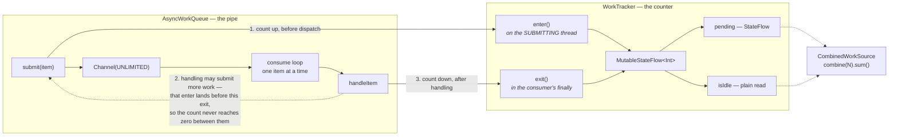

# Events, Async and State

> **Incomplete and permanently WIP.** These notes record what has been investigated, not what exists. Anything not mentioned here is almost certainly "not looked at yet" rather than "not there" or "not a problem". `EventBus`, `EventHandler`, `WorkSource`, `WorkTracker`, `AsyncWorkQueue`, `CombinedWorkSource`, `GameStateService`, `GameService`, `GameServiceRegistry`, `GameInitializer`, `ServiceAsync` and `AsyncFactory` were read in full. Not covered: `SingleFileSaveStateService` (the actual disk format and write path — only its call sites here were read), `Event`/`GameEvents`, and how any consuming project names or uses its own additional threads.

Four coupled concerns: how events are dispatched, how outstanding work is counted so a caller can tell when things have settled, which named thread work lands on, and how game state is loaded, mutated and persisted. Read this before writing an event handler, before implementing `WorkSource` on anything, before choosing between `update` and `updateAsync`, and before assuming a `save` actually wrote anything.

## Observations

### EventBus

- [invariant] Dispatch matches the **exact runtime class**: the loop does `eventHandlers[event::class]`. A handler registered for a base type never fires for a subclass #silent-failure.
- [fact] It is single-threaded and FIFO. The bus composes an `AsyncWorkQueue<Event>` on an `AsyncFactory` context named `Event-Thread`, which receives from one channel sequentially inside one coroutine and calls `dispatch` per event.
- [fact] The channel is **unbounded**, so `enqueueEvent` is non-suspend and never parks its caller. It was rendezvous (capacity 0) until the queue migration, which is why a `Sync` variant existed to launch onto the bus thread rather than suspend.
- [trap] Because one loop invokes handlers sequentially and handlers may suspend (`callSuspend`), a slow handler blocks every event behind it. Head-of-line blocking is structural, not incidental #order-dependent.
- [question] `dispatch` also runs the handlers *for a single event* one after another, and consumers have worked around the resulting lag by moving logic into interceptors or reading state directly in the View rather than via an event. Running one event's handlers concurrently is a genuinely different proposal from running several events concurrently: it keeps the between-events ordering that consumers depend on, and since the migration to `AsyncWorkQueue` it is contained to one function. Unexplored, and two things would decide it: handlers that hop to the rendering thread would re-serialize there anyway, and concurrent handlers mutating shared state is a hazard the sequential design currently rules out.
- [trap] `enqueueEvent` is **not synchronous**, despite being non-suspend and never parking. It hands the event to the queue and returns; handlers run later on the Event-Thread, so state is not settled when it returns #order-dependent.
- [trap] `registerHandler` appends to a `MutableList` with **no deduplication**, and `ClassHandlerMapping` caches one handler instance per annotated function, so re-registering the same object appends the *same instance* again. `unregisterHandler` calls `remove(handler)`, which drops only one occurrence — so N registrations against one unregistration leave N-1 live copies and the event fires N-1 times #silent-failure.
- [invariant] `EventHandler.handle` is `suspend` and `dispatch` awaits it, so a handler's iteration stays outstanding for the whole of whatever it suspends on — including a hop to another thread and back. Anything observing "is the bus busy" therefore transitively observes work a handler dispatched elsewhere, and needs no separate view of that other queue #order-dependent.
- [trap] The same property is why nothing may block a thread waiting for the bus to quiesce while a handler is suspended waiting for *that* thread: the handler occupies the bus and neither side can proceed.
- [fact] Handlers are discovered reflectively from `@HandlesEvent`-annotated member functions. A zero-parameter function takes its event type from the annotation; a one-parameter function takes it from the parameter type.
- [fact] `dispose()` disposes the queue (closing the channel and its context) and clears both handler maps. Enqueuing afterwards is dropped and logged at DEBUG rather than warned about, because at shutdown it is routine and the queue cannot tell that case from a caller holding a disposed bus.
- [fact] `isIdle` and `awaitIdle()` report whether every enqueued event has finished dispatching. `isIdle` is a plain read and safe on the rendering thread; `awaitIdle()` suspends and must never be called from a handler, which would wait on itself.
- [trap] Dispatch is reflective (`KCallable.call`) and never sets `isAccessible`, so a handler declared on a **private class** cannot be invoked. It compiles, registers without complaint, and throws `IllegalCallableAccessException` when its first event arrives.
- [history] Handler invocation is wrapped in a per-handler `try`/`catch` that logs and continues. Before that, an exception escaping any handler cancelled the loop coroutine and **the bus stopped dispatching for the rest of the process** — which presents as the application quietly freezing rather than as an error, and is the shape of several long-standing "had to restart it" reports #silent-failure.
- [invariant] That `catch` rethrows `CancellationException` before catching `Exception`. Swallowing it would break shutdown, since cancellation is how the loop is meant to stop.
- [fact] The logged throwable is unwrapped from `InvocationTargetException` first, because reflective invocation otherwise buries the real fault under reflection frames.

### Work tracking and idle checks

- [invariant] **Count on submit, not on start.** `AsyncWorkQueue.submit` calls `tracker.enter()` on the calling thread before the item reaches the channel. Counting inside the consumer instead leaves a window where `submit` has returned and the count still reads zero — which is exactly when a caller asks whether it is safe to act #order-dependent.
- [invariant] The same rule is what makes a single combined read a fixpoint rather than a quiet period: work that spawns work is counted before its parent's `exit` runs, so the total never touches zero mid-cascade and **no settling delay is needed anywhere**. Every `WorkSource` implementor owes this; one that breaks it produces a false idle no debounce would fix.
- [fact] `WorkSource` is the composition point — `isIdle`, `pending`, `awaitIdle` — implemented by `WorkTracker`, `AsyncWorkQueue` and `EventBus`, and by consumers that hold a tracker of their own. `CombinedWorkSource` composes N of them and is itself one, so composites nest.
- [decision] `WorkSource.pending` is `Flow<Int>`, not `StateFlow<Int>`. `combine` returns a cold flow, and narrowing it would need `stateIn(scope)` — a scope a framework object with no lifecycle should not own. Single-tracker implementors override with the narrower `StateFlow` type, so a direct holder keeps `.value`.
- [trap] `combine()` over **zero** flows completes without ever emitting, so `first { it == 0 }` throws `NoSuchElementException` rather than returning. `CombinedWorkSource.awaitIdle` short-circuits on `isIdle` first, which covers the empty case and also avoids building a channel plus a coroutine per source on every already-settled call #silent-failure.
- [decision] A consuming project subclasses `CombinedWorkSource` naming its own sources rather than constructing it with a vararg. ktx-inject resolves constructor parameters from the container by type and has nothing to resolve a vararg against, and keying on type is what lets two composites over different source sets coexist.
- [decision] `stop()` lets the **in-flight item finish** before the loop exits — `handleItem` runs inside `withContext(NonCancellable)`, so cancellation ends the loop at the next `receive()` rather than mid-handler. A handler that has started has usually already had a side effect, and killing it there loses the work while the `finally { exit() }` still counts it as handled. The live case: `MetricsService.stop()` runs on **every exit from the run screen** (`DuringRunController.hide` → `GameInitializer.dispose` → `stopAll`), not only at app shutdown, so the old behavior silently dropped whichever metric was mid-POST — `RUN_END` most often, since it is enqueued last #silent-failure.
- [trap] The cost of that: cancellation is no longer an escape from a stuck handler, so **a handler doing I/O owes itself a timeout**. `MetricsApiClient` is covered by CIO's defaults (`requestTimeout` 15s, `connectTimeout` 5s), which bounds how long a `NonCancellable` block can outlive the cancel. A handler with no timeout would hang the loop indefinitely.
- [decision] `stop()` cancels the loop and **leaves the count alone**; `dispose()` zeroes it and logs what was lost. Stop means "stop processing", and a restartable stop must keep the count or `start()` resumes against a lie. Dispose must zero it, because a count stuck above zero with no consumer hangs every later `awaitIdle` rather than failing.
- [risk] **Concentration.** The bus, metrics, the notification queue and every idle check now run on one `AsyncWorkQueue`, so a single missed `exit()` breaks all of them at once — and it surfaces as a hang at someone's timeout rather than as an error, because a count that never reaches zero has nothing to report. This is why the queue is unit-tested in kgdfw directly rather than only through its consumers #silent-failure.
- [trap] The per-item `try`/`catch` in the consume loop means a handler exception can no longer kill the queue, so a stranded count is no longer a symptom worth testing for. Any test asserting a consumer survived has to assert on the *next* item being handled, never on the count returning to zero — the outer `finally` zeroes it on every exit path, so a dead consumer and a healthy one look identical through the counter #silent-failure.

### GameService lifecycle

- [trap] A `GameService` registers itself from its own `init` block (`registry.register(this)`, with a `@Suppress("LeakingThis")`). It is therefore in the registry simply by being constructed — there is no registration call to grep for, and it is registered before its own constructor has finished.
- [fact] `GameServiceRegistry` is a flat `mutableSetOf<GameService>` with `startAll` / `stopAll` / `tickAll(delta)` / `dispose`, each a bare `forEach`. No ordering guarantee between services, and no error isolation: one service throwing from `start` aborts the rest of the loop.
- [fact] `GameService.start()` registers the service's own event handlers then calls `startInternal()`; `stop()` unregisters them then calls `stopInternal()`. `tick(delta)` and `dispose()` default to no-ops.
- [invariant] `startAll` / `stopAll` reach the registry only through `GameInitializer.initialize()` / `.dispose()`, and nothing calls `tickAll` from inside the framework. **The framework never starts or ticks a service on its own** — a consuming project decides when, and a service whose screen never runs that code silently never starts #silent-failure.

### Threads

- [fact] `AsyncFactory.newAsyncContext(name)` returns `newSingleThreadAsyncContext(name)` — every context it hands out is a single thread. It is `open`, so tests can substitute a deterministic scheduler.
- [fact] `ServiceAsync` owns a single thread named `Service-Thread`, exposed as `launchOnServiceThread` (fire and forget) and `onServiceThread` (suspending `withContext`). It is an injected class taking an [AsyncFactory], not an object, so a test can substitute a scheduler and drain it.
- [decision] **Finding no callers for `ServiceAsync` or `updateAsync` is expected and is not grounds for deleting them.** Turn-based consumers have nothing to put on a background service thread, because everything they do is reachable from the render loop. Real-time consumers are what it exists for. This has been proposed for deletion once on a zero-callers argument; the answer is no.

### GameStateService

- [trap] `load()` returns `gameState.clone()`, **not** the cached instance. Mutating what `load()` gave you changes nothing until `save()` — except for whatever the consumer's `clone()` leaves shallow, which is visible immediately and permanently.
- [trap] `save(state, forceUpdate = false)` **silently does nothing** when the state is already initialised, `forceUpdate` is false, and `state == cachedState`. Whether a mutation is detected therefore depends entirely on the consumer's `equals` #silent-failure. If a mutable object inside the state has identity-ish equality, mutating it is invisible here and the write is dropped — pass `forceUpdate = true` on any path that mutates such an object.
- [fact] `update(forceUpdate) { }` is **fully synchronous**: it is `load().apply { update(); save(this, forceUpdate) }`, running on the calling thread and returning after the save.
- [fact] `updateAsync(forceUpdate) { }` is the same call wrapped in the injected `ServiceAsync.launchOnServiceThread`, i.e. fire-and-forget on `Service-Thread`. Because that context now comes from `AsyncFactory`, a test scheduler drains it like any other.
- [fact] `save` enqueues the consumer's `updatedEvent(clone)` onto the EventBus before writing to disk.
- [fact] `load()` initialises from `stateService.loadState()` when a save file exists, otherwise builds `initNewState()` and immediately saves it.

## Relations

- see_also [[Interception]]
- see_also [[Logging]]
